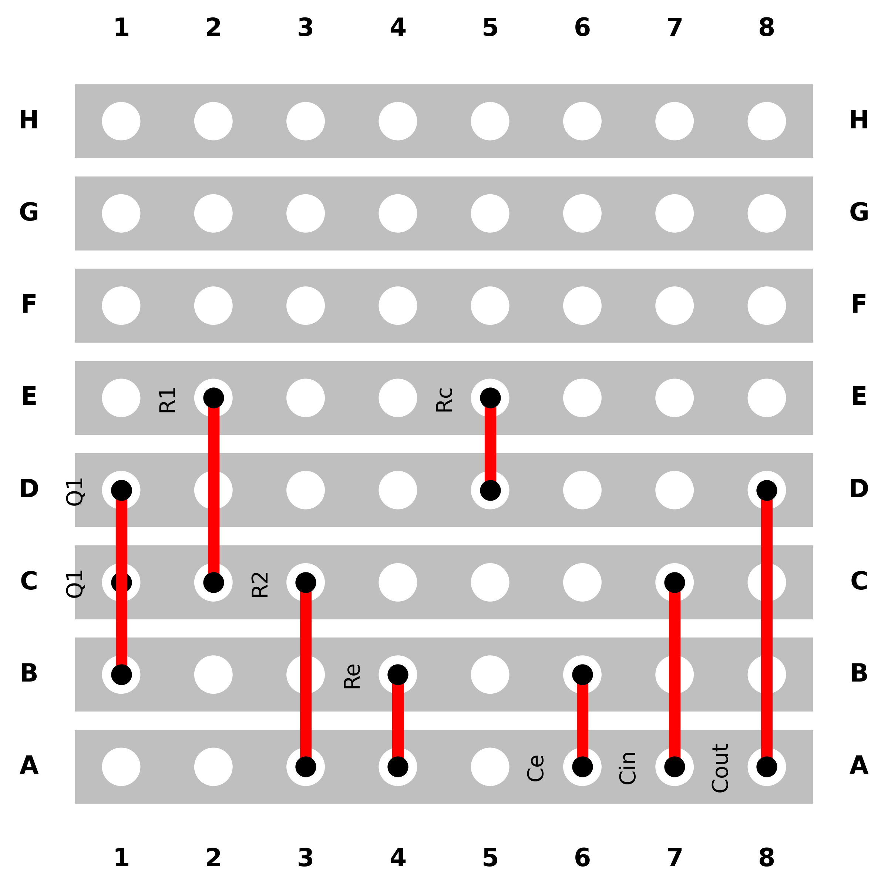

<p align="center">
  
<br>
Electronics stripboard component placement optimisation using <a href=https://networkx.org/> NetworkX </a> and <a href=https://developers.google.com/optimization> Google OR-Tools CP-SAT </a>.

</p>

------

<p align="center">
  
</p>


Installation
------------

Install from the GitHub repository:

```bash
git clone git@github.com:dpohanlon/wadjet.git
cd wadjet
pip install .
```


Usage
------------

Define components to be placed

```Python
bjt = BJT(name="Q1", bjt_type="NPN")

R1 = Resistor(name="R1")
R2 = Resistor(name="R2")
Re = Resistor(name="Re")
Rc = Resistor(name="Rc")

Ce = Capacitor(name="Ce", electrolytic=True)
Cin = Capacitor(name="Cin", electrolytic=True)
Cout = Capacitor(name="Cout", electrolytic=True)

Vcc = PowerSupply(name="Vcc", voltage_level="5V")
GND = PowerSupply(name="GND", voltage_level="GND")

component_list = [bjt, R1, R2, Re, Rc, Ce, Cin, Cout, Vcc, GND]
```

Specify the connections between the component legs according to a schematic

```Python
connections = {
    # Power and ground
    "Vcc": ["Rc_in", "R1_in"],
    "GND": ["Re_out", "R2_out", "Cin_anode", "Cout_anode"],
    # Biasing the transistor base using R1 and R2
    "R1_out": ["base_junction"],
    "R2_in": ["base_junction"],
    "base_junction": ["Q1_base", "Cin_cathode"],
    # Emitter resistor and capacitor
    "Q1_emitter": ["Re_in", "Ce_cathode"],
    "Ce_anode": ["GND"],
    # Collector resistor and output
    "Q1_collector": ["Rc_out", "Cout_cathode"],
    # Note: Input signal would be fed into Cin and output taken from Cout
}

```

Optimise the placement for minimal path length, and produce a diagram for soldering

```Python
board = generateBoard(component_list, connections)
```
